# Property Graphs Lab Assignment

## A.1 Modeling
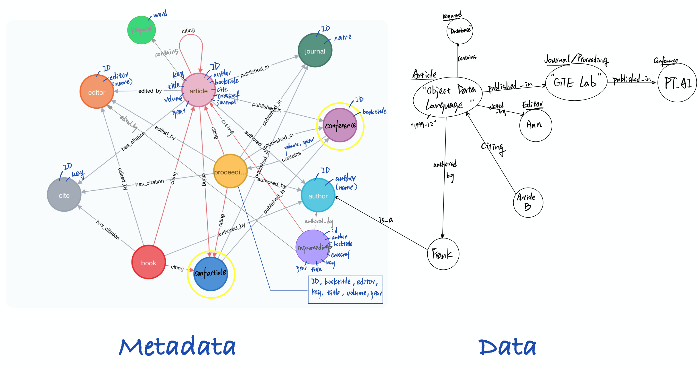
The base of the graph is followed by the default setting from `dblp`. Based on the query in Part B, general `Conference` nodes are derived from `Proceedings` where the edge `contains` has property of each `volume` and `year`. `confarticle` is derived from `inproceedings` with the same properties, but only cited works are extracted. Also, `citing` is created from `cite` to outperform the 'number of citation' aggregation.

## A.2 Instantiating/Loading
The original database is parsed through the     `dblp-to-csv` tool available in [GitHub](https://github.com/ThomHurks/dblp-to-csv). When passing the `--neo4j` option, the type annotations will be Neo4j compatible, and the tool generates a shell script called `neo4j_import.sh` that can be run to import the generated CSV files into a Neo4j graph database using the `neo4j-admin import` bulk importer tool.
Further changes are performed in Cypher and saved as `PartA.2_LiJin`.

## A.3 Evolving the graph
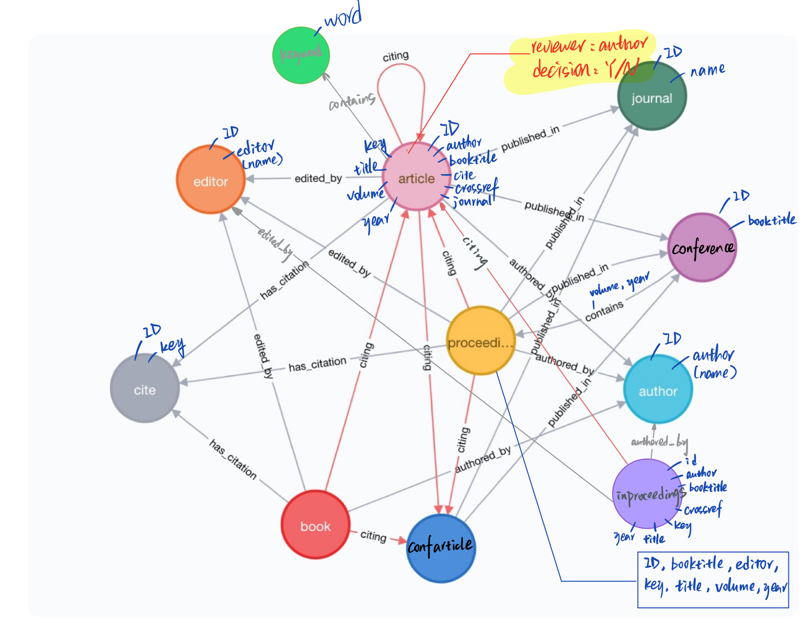
We create the `reviewers` property for each article/inproceeding based on the community of the corresponding journal/conference (derived from PartB.3). Random 3 reviewers are assigned to each paper (different from the author). `decision` on the review is also randomly assigned to each reviewer based on a `rand()` function in Cyther.

For the `affiliation`, given the missing raw data, it is randomly assigned for each author a specific university.

## B Querying
### 1. H-index

```
MATCH ()-[c:citing]->(p:article)-[:authored_by]->(a:author)
WITH a, p, count(c) as numCit
ORDER BY numCit
WITH a, collect(numCit) AS NumCit
WITH a, NumCit, range(0, size(NumCit)) AS is
UNWIND is AS i
WITH a, NumCit[i] as numCit, i
WHERE (i+1) < numCit
RETURN distinct a.author as authorName, max(i) as hIndex
ORDER BY hIndex DESC
```
Testing result:

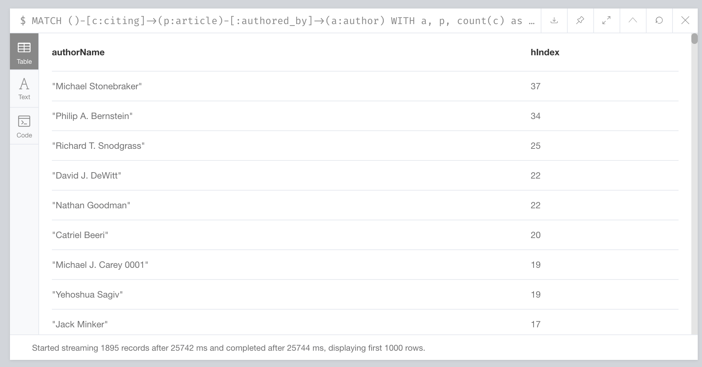

### 2. Top 3 for each conference
```
MATCH ()-[c:citing]->(p:confarticle)-[con:published_in]->(conf:conference)
with distinct p, count(c) as citnum, conf ORDER BY citnum DESC
with conf, collect(p.title) as array_1, collect(citnum) as array_2
return distinct conf.booktitle, array_1[..3], array_2[..3]
```
Testing result:

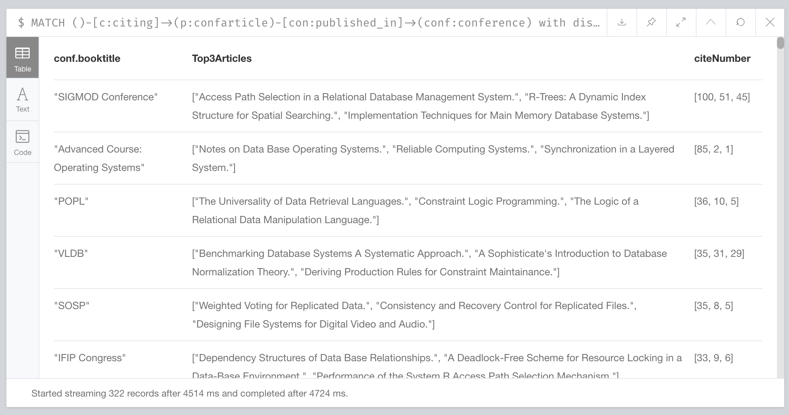

### 3. Community for each Conference

```
MATCH(conf:proceedings)
WITH distinct conf.booktitle as confTitle #LIMIT 25
MATCH (inp:inproceedings{booktitle:confTitle})-[:authored_by]->(a:author)
WITH distinct a, collect(distinct inp.key) as inps, confTitle
WHERE size(inps)>=4
RETURN confTitle, collect(a.author)
```

Testing result:

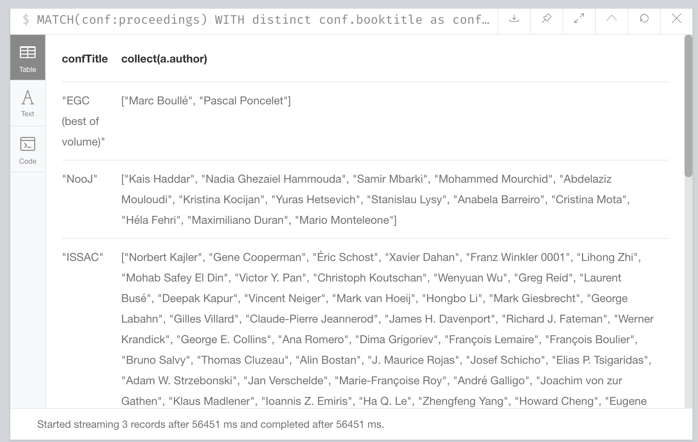

### 4. Impact factor of journals

```
MATCH ()-[c:citing]->(a:article)
with a, count(c) as citnum
MATCH (j:journal)<-[pi:published_in]-(a:article)
with j, a.year as year, count(pi) as pnum, sum(citnum) as cnum
with j, collect(year) as Year, collect(pnum) as Pnum, collect(cnum) as Cnum
with j, Year, Pnum, Cnum, range(0, size(Year)-1) AS is
UNWIND is AS i
return j.journal, Year[i] as year, Cnum[i]/Pnum[i] as impact
order by impact desc, j.journal, year
```

Testing result:

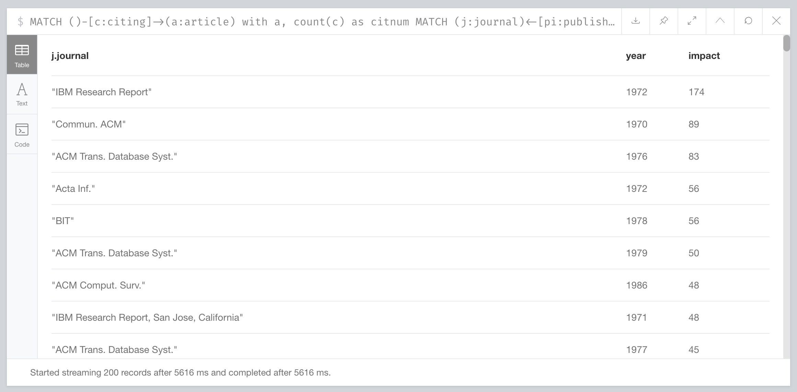

## C Graph algorithms

### 1 Case Description
In order to realize the function of the page rank algorithm, based on the lowest level sub-graph can not only know the details of algorithms more clearly but also reduce the running time of large amounts of the dataset. So, paying attention to specific node and relationship with less amount is a good approach thus “book” and “school” node as well as “submitted at” relationship using in our lab.

Case Schema:

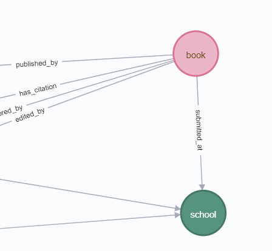

### 2 Page Rank Algorithm

PageRank, page rank, also known as page rank or page rank, is a technique for ranking pages based on mutual hyperlinks between pages, named after the founder of Google, Larry Page. Google uses it to reflect the relevance and importance of web pages and is one of the effective indicators for evaluating web page optimization in search engine optimization operations. It determines the rank of a page through the vast network of hyperlink relationships. Google interprets the link from page A to page B as page A votes for page B. Google determines the new rank based on the rank of the voting source (or even the source of the source) and the voting target. Simply put, a high-level page can increase the level of other low-level pages.
Calling “page rank. stream” with Cypher project in two nodes, we get the result of the “book” node page rank score for its every “book id”.Figure below illustrates that score-0.15 for every “book id” means that every book has little and same incoming link in the relationship of “book” and “school” node due to the book id is an attribute with minimum level with little incoming relationships.

Testing result:

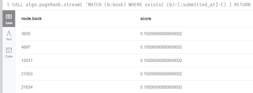

```
CALL algo.pageRank.stream(
  'MATCH (b:book) WHERE exists( (b)-[:submitted_at]-() ) RETURN id(b) as id',
  'MATCH (b:book)-[:submitted_at]-(s:school) RETURN id(b) as source, id(s) as target',
  {graph:'cypher'}
) YIELD nodeId,score with algo.asNode(nodeId) as node, score order by score desc limit 10
RETURN node.book, score
```

Also, calling “alog.pageRank” function with the same nodes and relationship. iterations, loadMillis, computeMillis, writeMillis, dampingFactor, write and writeProperty shows the detail configuration and result of page rank algorithm.

Testing result:

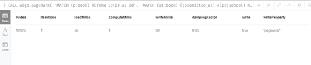

```
CALL algo.pageRank(
  'MATCH (p:book) RETURN id(p) as id',
  'MATCH (p1:book)-[:submitted_at]->(p2:school) RETURN id(p1) as source, id(p2) as target',
  {graph:'cypher', iterations:1, write: true});
```

### 3 Betweenness Centrality Algorithm
It is one of the measures for the centrality of the network graph based on the shortest path. For a fully connected network graph, where any two nodes have at least one shortest path, in a weightless network graph, the shortest path is the sum of the number of edges that the path contains, and in a weighted network graph, the shortest path is the weight of the path containing edges. Sum. The median centrality of each node is the number of times these shortest paths pass through the node. Betweenness Centrality has a wide range of applications in network theory: it represents the degree of interaction between a node and other nodes. For example, in a communication network, a node with higher median centrality has stronger control capabilities in the network, because more information will pass through the node when it is passed. 
Needless to say, using the same nodes and relationships can identify the difference between centrality algorithm and page rank algorithm thus using school and nodes relationships. Unlike the previous one, based on the Cypher language as below, we check the Centrality of the school name with any kind of relationship in our schema. According to Figure below, the Centrality 0 means there is no shortest path go via in these school name because they are low-level attribute and has no other links. 

Testing result:

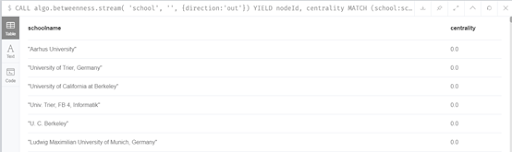

```
CALL algo.betweenness.stream( 'school','',{direction:'out'})
YIELD nodeId, centrality
MATCH (school:school) WHERE id(school) = nodeId
RETURN school.school AS schoolname,centrality
ORDER BY centrality DESC;
```

Figure below shows that the details results of algorithm.

Testing result:

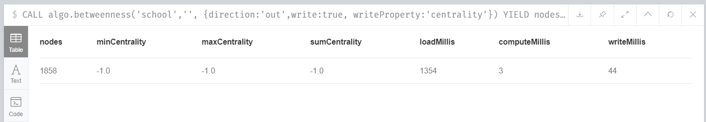

```
CALL algo.betweenness('school','', {direction:'out',write:true, writeProperty:'centrality'})
YIELD nodes, minCentrality, maxCentrality, sumCentrality, loadMillis, computeMillis, writeMillis;
```

## D Recommender

The `keywords` are derived from the paper title (tokenize & remove stop words) (details in `d_dataprocess`).

### 1 Define research community

```
MATCH (paper:paper {key:row.key})
MATCH (usedKeyword:keyword {keyword:keyword})
MERGE (paper)-[:HasKeyword]-(usedKeyword)
```

### 2 Conference/Journal with Community

```
MATCH (a:article)-[:published_in]->(conf)
WITH distinct conf, a, count(a) as noArticle
MATCH (key:keyword)-[hk:hasKeyword]->(a)
WITH distinct conf, key, count(hk) as noWithKeywords, noArticle
WHERE noWithKeywords/noArticle >= 0.9
CREATE (conf)-[:communityOf]->(key)
```

### 3 Top 100 papers of the conference/journal

```
page.rank(100)
CREATE (a:article)-[:qualifiedReviewer]->(key:keyword)
```

### 4 Identify gurus

```
MATCH (a:article)-[:qualifiedReviewer]->(key:keyword)
WITH a, key
MATCH (a)-[ab:authored_by]->(b:author)
WITH a, b, count(ab) as weight
WHERE weight >= 2
RETURN a as Gurus
```
