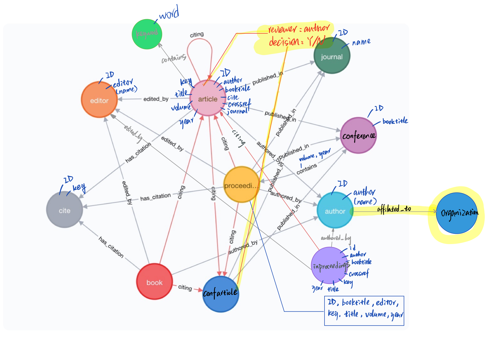

# Property Graphs Lab Assignment

## A.1 Modeling

The base of the graph is followed by the default setting from `dblp`. Based on the query in Part B, general `Conference` nodes are derived from `Proceedings` where the edge `contains` has property of each `volume` and `year`. `confarticle` is derived from `inproceedings` with the same properties, but only cited works are extracted. Also, `citing` is created from `cite` to outperform the 'number of citation' aggregation.

## A.2 Instantiating/Loading
The original database is parsed through the     `dblp-to-csv` tool available in [GitHub](https://github.com/ThomHurks/dblp-to-csv). When passing the `--neo4j` option, the type annotations will be Neo4j compatible, and the tool generates a shell script called `neo4j_import.sh` that can be run to import the generated CSV files into a Neo4j graph database using the `neo4j-admin import` bulk importer tool.
Further changes are performed in Cypher and saved as `PartA.2_LiJin`.

## A.3 Evolving the graph

We create the reviewers for each article/inproceeding based on the community of the corresponding journal/conference (derived from PartB.3). Random 3 reviewers are assigned to each paper.

## B Querying

## C Graph algorithms

## D Recommender
